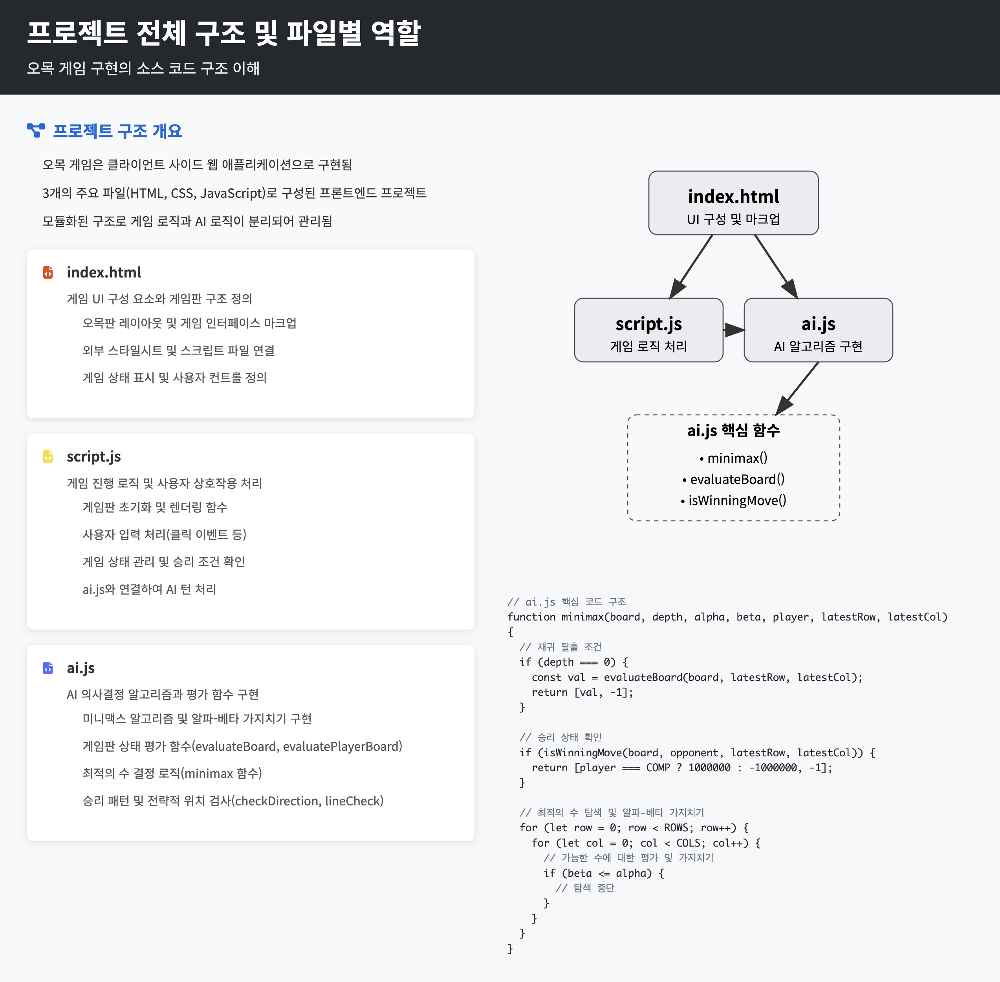
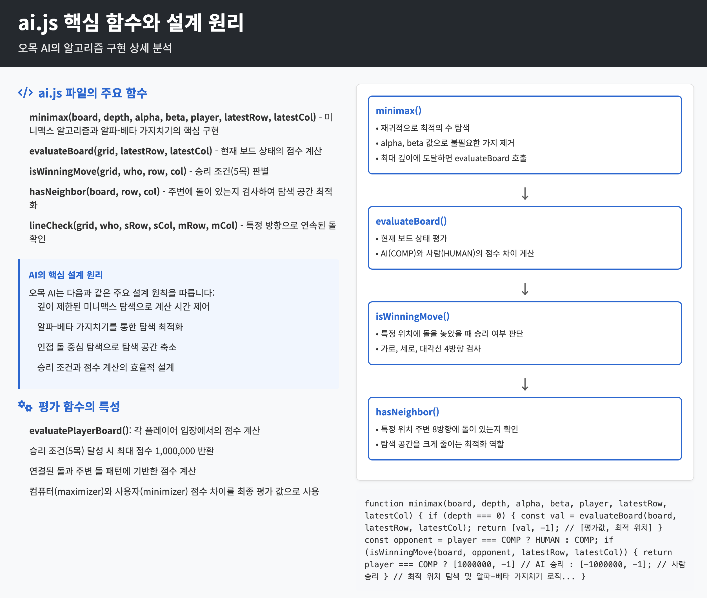
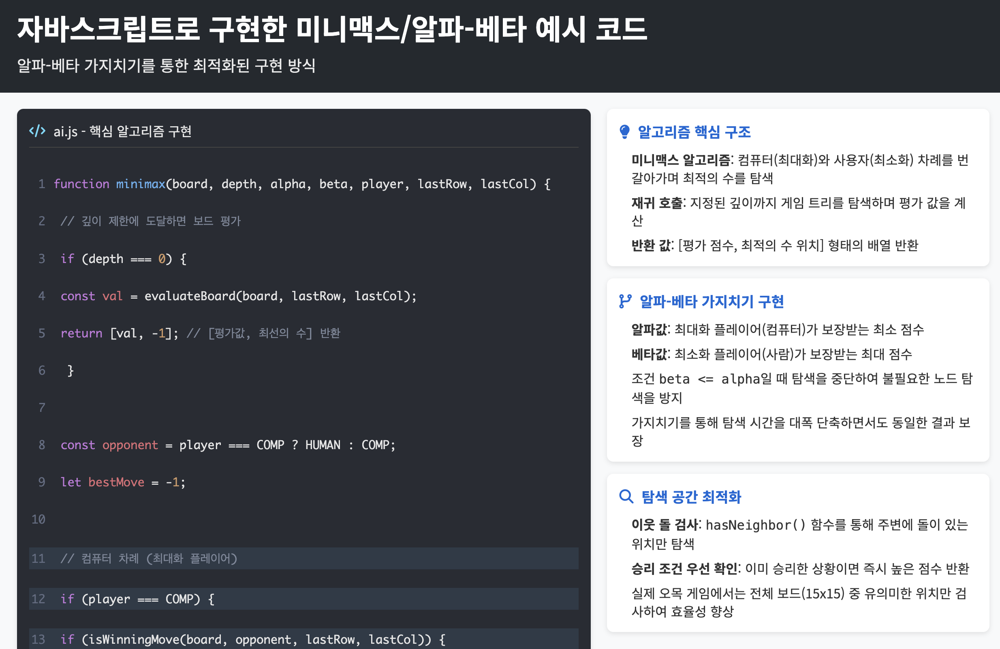
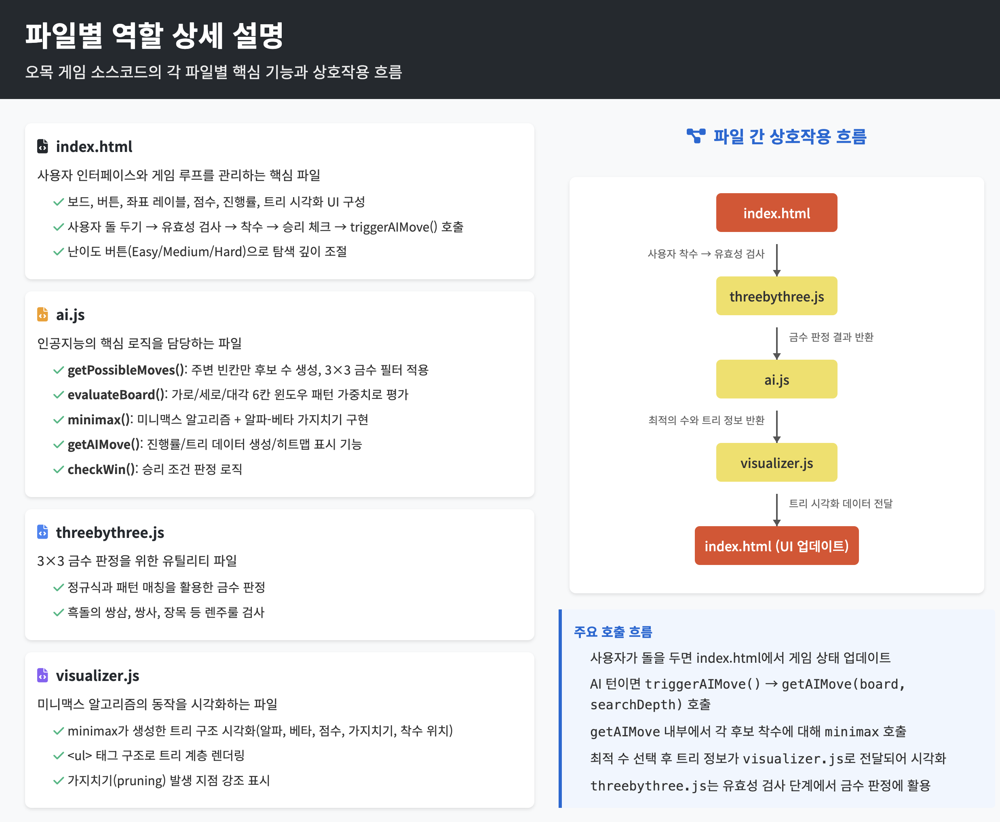
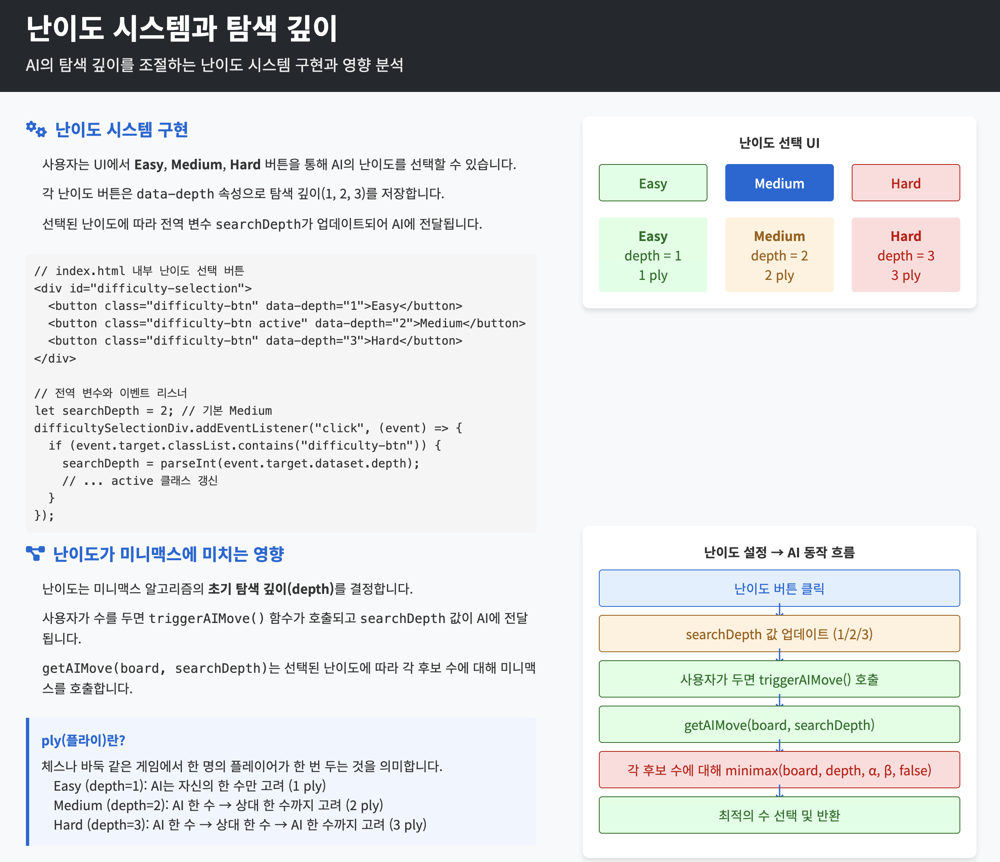
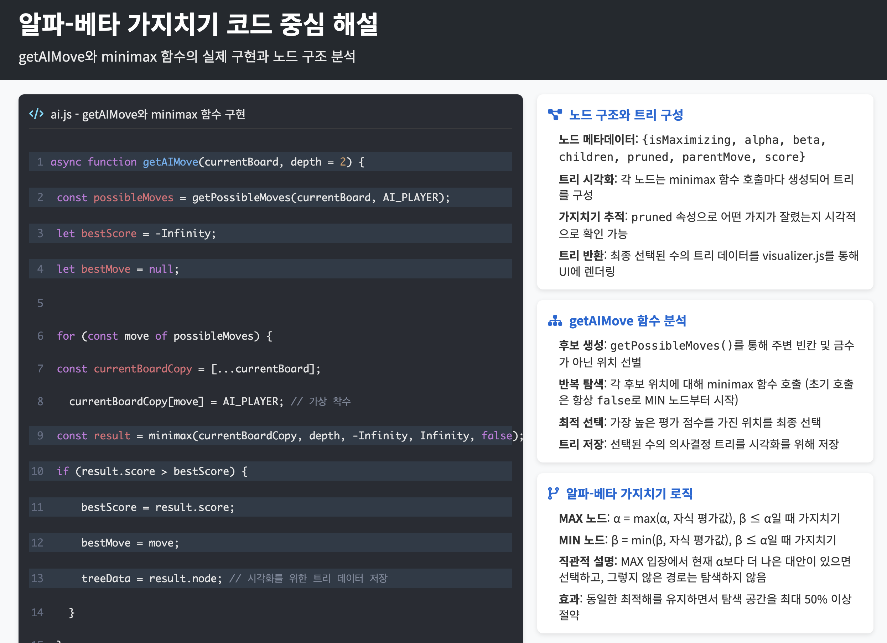
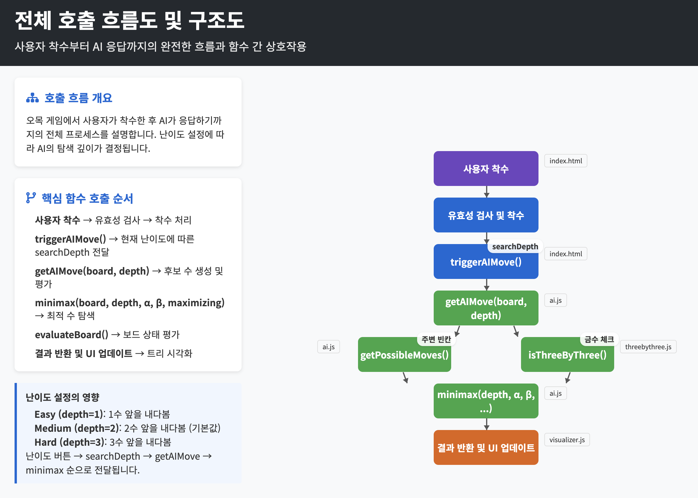

# Gomoku Game with Minimax AI

This project is a Gomoku (Five in a Row) game implemented in HTML, CSS, and JavaScript, featuring a Minimax AI opponent.

## How to Run

### 1. Running the Web Server

To play the game, you need to run a local web server. This project can be served using any simple HTTP server.

For example, using Python's built-in HTTP server:

```sh
python3 -m http.server 8000
```

Once the server is running, you can access the game at `http://localhost:8000`.

### 2. Running the Playwright Tests

The project includes end-to-end tests written with Playwright.

#### Prerequisites

Before running the tests, you need to install the project dependencies and the Playwright browsers.

1.  **Install Dependencies:**
    The `npm install` command installs all the necessary packages defined in the `package.json` file, which includes Playwright.

    ```sh
    npm install
    ```

2.  **Install Playwright Browsers:**
    This command downloads the browser binaries (Chromium, Firefox, WebKit) that Playwright uses for testing.

    ```sh
    npx playwright install
    ```

#### Running the Tests

1.  **Start the web server:**
    Make sure the web server is running on port 8000 as described above.
    ```sh
    python3 -m http.server 8000 &
    ```

2.  **Run the tests:**
    ```sh
    npx playwright test
    ```

3.  **View the test report:**
    ```sh
    npx playwright show-report
    ```
    
#### 프로젝트 구조 슬라이드 (라이브 데모)
[](https://wonyonghwang.github.io/kopoomok/page1.html)
[](https://wonyonghwang.github.io/kopoomok/page2.html)
[](https://wonyonghwang.github.io/kopoomok/page3.html)
[](https://wonyonghwang.github.io/kopoomok/page4.html)
[](https://wonyonghwang.github.io/kopoomok/page5.html)
[](https://wonyonghwang.github.io/kopoomok/page6.html)
[](https://wonyonghwang.github.io/kopoomok/page7.html)
